# Báo cáo cá nhân — K4-L3A Day 13 Monitoring & LLMOps

> Mỗi học viên hoàn thiện một file duy nhất này. Khi dẫn evidence, dùng đường dẫn tương đối, ví dụ `evidence/07-trace-waterfall.png`.

## 1. Thông tin học viên

- **Họ và tên:** Nguyễn Xuân Khuê
- **MSSV:** 2A202602999
- **Lớp:** K4-L3A
- **Repository URL:** https://github.com/Sinonmoe/K4-L3-DAY13-NguyenXuanKhue-2A202602999-Monitoring-LLMOps
- **Commit SHA cuối:** 4cbba8c
- **Challenge ID:** `day13-k4-l3a-monitoring-llmops-v1`
- **Tên project Langfuse cá nhân:** `day13-k4-l3a-2A202602999`

## 2. Evidence index

Điền đúng đường dẫn tới evidence thực tế. Có thể đổi tên hoặc dùng nhiều ảnh nếu cần.

| Evidence | Đường dẫn |
|---|---|
| Pytest cuối | `evidence/01-pytest.png` |
| Log validator | `evidence/02-log-validator.png` |
| Dashboard validator | `evidence/03-dashboard-validator.png` |
| Structured log | `evidence/04-structured-log.png` |
| PII redaction | `evidence/05-pii-redaction.png` |
| Trace list | `evidence/06-trace-list.png` |
| Trace waterfall | `evidence/07-trace-waterfall.png` |
| Trace metadata | `evidence/08-trace-metadata.png` |
| Prompt versions | `evidence/09-prompt-versions.png` |
| Prompt rollback | `evidence/10-prompt-rollback.png` |
| Dashboard runtime | `evidence/11-dashboard-overview.png` |
| Incident metric | `evidence/12-incident-metric.png` |
| Incident log | `evidence/13-incident-log.png` |
| Incident trace | `evidence/14-incident-trace.png` |

## 3. Kết quả kỹ thuật

| Nội dung | Baseline | Kết quả cuối | Nhận xét |
|---|---|---|---|
| `validate_logs.py` | 30/100 | 100/100 | Đạt điểm tuyệt đối sau khi bind contextvars, correlation ID và PII scrubbing |
| `validate_dashboard.py` | 6/6 panel hợp lệ | 6/6 panel hợp lệ | Đạt chuẩn 6/6 panel theo dashboard contract schema |
| `pytest` | 22/22 passed | 24/24 passed | 100% test pass (đã bổ sung unit test cho CCCD và thẻ thanh toán) |
| Số traces hợp lệ | 0 trace | 35+ traces | Đã tạo và đẩy thành công các trace hợp lệ lên Langfuse Cloud |
| Số PII leak | 0 leak | 0 leak | Không phát hiện PII leak trong logs sau khi scrub |
| Latency P95 / TTFT P95 | 151 ms / 50 ms | 154 ms / 50 ms (bình thường) | Đo từ dashboard và logs runtime |
| Retrieval success rate | 100% (10/10) | 100% | Retrieval hoạt động ổn định |

### Minh chứng kiểm thử và Validator

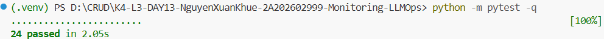

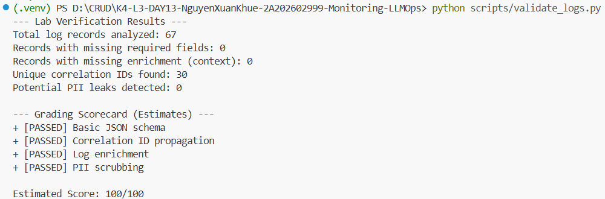

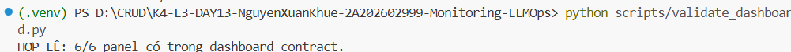

## 4. Logging và PII

- **Cách tạo/nhận và truyền correlation ID:** Trong `CorrelationIdMiddleware` (`app/middleware.py`), mỗi request được gọi `clear_contextvars()` để xóa context cũ. Sau đó kiểm tra header `x-request-id`, nếu có thì sử dụng lại, nếu không thì sinh mới theo format `req-<8-hex>` (`f"req-{uuid.uuid4().hex[:8]}"`). ID này được gắn vào `bind_contextvars(correlation_id=correlation_id)` cho structlog, gán vào `request.state.correlation_id` cho handler, và trả lại qua header `x-request-id` cùng `x-response-time-ms`.
- **Các metadata được ghi vào structured log:** Các trường chuẩn theo schema gồm `ts` (UTC ISO), `level`, `service`, `event`, `correlation_id`. Trong endpoint `/chat` (`app/main.py`), các trường ngữ cảnh được bind trước khi ghi log gồm `user_id_hash` (SHA256 12 ký tự), `session_id`, `feature`, `model`, `env`. Khi kết thúc request bổ sung thêm: `latency_ms`, `ttft_ms`, `tokens_in`, `tokens_out`, `cost_usd`, `quality_score`, `tool_name`, `tool_success`, và `payload` đã được che PII.
- **Cách bảo đảm PII được scrub trước khi ghi:** Xây dựng các regex chuẩn hóa trong `app/pii.py` cho `email`, `phone_vn`, `credit_card`, `cccd` và thay thế bằng `[REDACTED_<TYPE>]`. Đăng ký `scrub_event` như một structlog processor đệ quy chạy trước `JsonlFileProcessor()` và `JSONRenderer()`, đảm bảo mọi trường dữ liệu string hoặc cấu trúc lồng nhau trong event dict đều được che sạch trước khi ghi ra file `data/logs.jsonl` hoặc stdout.
- **Cách kiểm chứng kết quả:** Bộ unit test `tests/test_pii.py` kiểm tra đầy đủ cả 4 mẫu PII đều pass; kiểm tra thực tế bằng `python scripts/validate_logs.py` đạt 100/100 điểm với 0 missing required, 0 missing enrichment, 0 PII leak detected và correlation IDs được truyền chuẩn xác qua các log records.

### Minh chứng Logging và PII

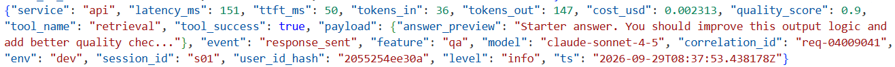

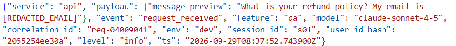

## 5. Tracing và prompt versioning

- **Cách xác nhận traces do chính tôi tạo trong project cá nhân:** Tất cả các trace được đẩy trực tiếp về project Langfuse riêng của tôi (`day13-k4-l3a-2A202602999`) qua API keys cấu hình trong `.env`. Trace metadata chứa thông tin định danh: `user_id_hash` (băm từ mã sinh viên 2A202602999), `session_id`, `environment: dev`, tags `["lab", feature, "claude-sonnet-4-5"]` và correlation ID tương ứng.
- **Cấu trúc root/retrieval/generation observations:**
  - Root observation: `lab-agent-run` (type `agent`), bao quát toàn bộ vòng đời của request.
  - Observation con 1: `retrieval` (type `retriever`), đo đạc bước tra cứu tài liệu với metadata `doc_count`, input và output sanitized.
  - Observation con 2: `generation` (type `generation`), đo bước gọi LLM (`FakeLLM`), nhận link prompt từ Langfuse, ghi nhận model, `usage_details` (input/output tokens) và `cost_details` (USD).
  - Cấu trúc cây quan hệ cha–con hiển thị rõ ràng trên trace waterfall, cho phép phân biệt chính xác khi xảy ra nghẽn ở bước retrieval (chậm >2.5s) hay generation.
- **Cách nối trace với log:** `correlation_id` được sinh từ middleware và gắn đồng thời vào `data/logs.jsonl` (qua structlog contextvars) và trace metadata trên Langfuse (qua `propagate_attributes(metadata={"correlation_id": correlation_id})`). Ta có thể copy correlation ID từ log line bất kỳ rồi dán vào ô tìm kiếm metadata trên Langfuse để mở đúng trace.
- **Prompt name:** `day13-chat`
- **Version/label baseline:** Version 1, gắn nhãn `baseline` và `production` ban đầu. Template: `Feature={{feature}}\nDocs={{docs}}\nQuestion={{message}}`.
- **Version/label candidate:** Version 2, gắn nhãn `candidate`. Template có tinh chỉnh: `Feature={{feature}}\nDocs={{docs}}\nQuestion={{message}}\nTrả lời ngắn gọn, súc tích trong 2 câu.`
- **Trace ID của mỗi version:**
  - Trace ID dùng Version 1 (`production` / `baseline`): `1ac3bb4d42a5cdef897cf68cc16025bd`
  - Trace ID dùng Version 2 (`candidate`): `c6539a4f0f88fcd8dd0eeb9a60172e1e`
- **Cách promote và rollback `production`:**
  - **Promote:** Trên Langfuse Cloud, mở prompt `day13-chat` > chọn Version 2 > gán thêm nhãn `production` (chuyển nhãn từ v1 sang v2).
  - **Rollback:** Khi cần khôi phục lại bản cũ, mở danh sách versions của `day13-chat` > chọn lại Version 1 > gán nhãn `production` về Version 1. Ứng dụng tự động lấy đúng bản v1 trong lần gọi tiếp theo mà không cần sửa code hay redeploy.

### Minh chứng Tracing và Prompt Versioning

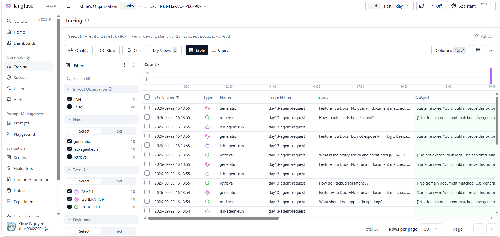

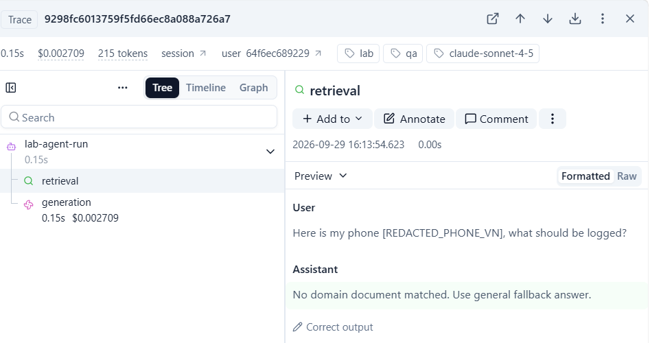

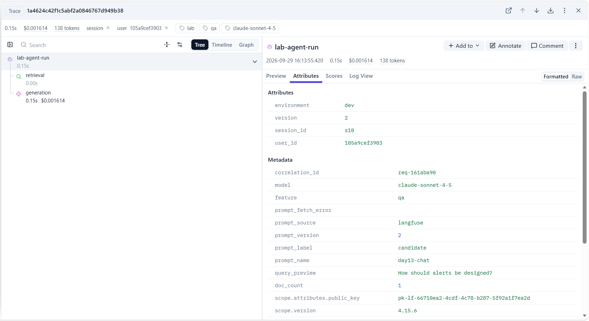

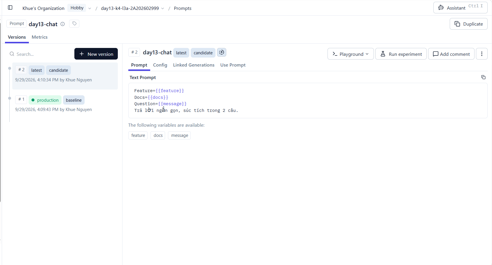

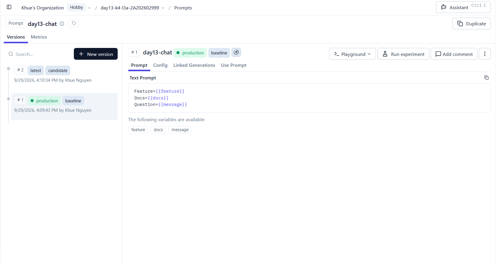

## 6. Dashboard, SLO và alerts

- **Dashboard và sáu panel:** Dựng đúng theo contract `config/dashboard.yaml` tại endpoint `/dashboard` (hoặc Streamlit), đọc từ `data/logs.jsonl` trong cửa sổ 60 phút và làm mới mỗi 30s:
  1. *Latency percentiles and TTFT* (ms): P50, P95, P99 và TTFT P95; threshold P95 &le; 3000 ms.
  2. *Request traffic* (requests_per_minute): số lượng request và tốc độ req/phút; threshold &ge; 1 req/min.
  3. *Error rate and retrieval success* (%): tỉ lệ lỗi, phân loại lỗi theo `error_type`, và tỉ lệ retrieval thành công (`tool_success == true`); threshold error rate &le; 2%.
  4. *Cost over time* (USD): tổng chi phí token trong cửa sổ thời gian; threshold &le; $2.50.
  5. *Input and output tokens* (tokens): tổng tokens nạp vào và tạo ra; threshold &le; 50,000 tokens.
  6. *Quality proxy* (score 0-1): điểm số chất lượng phản hồi trung bình; threshold &ge; 0.75.
- **SLO và lý do chọn:** Chọn `fast_successful_requests` với mục tiêu 99.5% requests đạt chuẩn (`event == "response_sent"` và `latency_ms <= 3000`) trong cửa sổ 28 ngày. Lý do chọn: Baseline bình thường đạt ~150ms. Ngưỡng 3000ms là ranh giới trải nghiệm người dùng đối với chat trợ lý LLM; nếu retrieval bị nghẽn (chẳng hạn incident `rag_slow` thêm 2500ms delay), latency sẽ lập tức chạm ngưỡng 3s để cảnh báo kịp thời trước khi timeout.
- **Cách tính error budget:**
  - Với SLO 99.5%, ngân sách lỗi (Error Budget) là `100% - 99.5% = 0.5%`.
  - Nếu hệ thống nhận 100,000 requests trong chu kỳ 28 ngày, Error Budget cho phép tối đa `100,000 * 0.5% = 500` bad requests (requests bị lỗi 500 hoặc có latency > 3000ms).
  - Khi số bad requests vượt quá 500, ngân sách lỗi cạn kiệt (Burn rate cao), kích hoạt chính sách đóng băng deploy tính năng mới để tập trung khắc phục sự cố.
- **Ba alert và runbook tương ứng:**
  1. `HighTailLatency`: Severity critical, duration 5m, condition `p95(latency_ms) > 3000ms`, channel `#alerts-llmops`, owner `oncall-backend`, runbook `docs/alerts.md#alert-1`.
  2. `HighErrorRate`: Severity critical, duration 3m, condition `error_rate_pct > 2%`, channel `#alerts-llmops`, owner `oncall-backend`, runbook `docs/alerts.md#alert-2`.
  3. `LowRetrievalSuccess`: Severity warning, duration 5m, condition `retrieval_success_rate_pct < 90%`, channel `#alerts-rag`, owner `oncall-rag`, runbook `docs/alerts.md#alert-3`.

### Minh chứng Dashboard Runtime

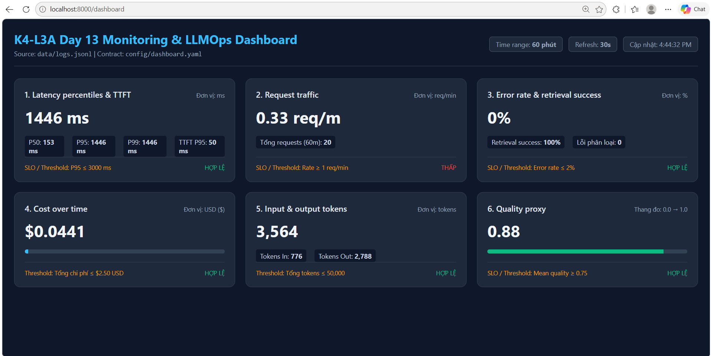

## 7. Điều tra challenge

- **Challenge ID:** `day13-k4-l3a-monitoring-llmops-v1`
- **Khoảng thời gian điều tra:** `2026-09-29 09:51:02 UTC` đến `2026-09-29 09:51:16 UTC` (16:51:02 - 16:51:16 ICT).
- **Triệu chứng từ metrics:** Panel **Latency percentiles and TTFT** trên Dashboard ghi nhận độ trễ P95 tăng vọt từ mức baseline ~151 ms lên **2656 ms**, vượt ngưỡng threshold của challenge là **2000 ms**. Trong khi đó, TTFT P95 vẫn ở mức tốt (**50 ms**), chứng tỏ độ trễ không xuất phát từ việc khởi tạo token của LLM.
- **Log line và correlation ID liên quan:**
  - Correlation ID: `req-4a6887a6`
  - Log `request_received`:
    ```json
    {"service": "api", "payload": {"message_preview": "Explain why metrics traces and logs work together."}, "event": "request_received", "model": "claude-sonnet-4-5", "session_id": "k4-l3a-challenge-s01", "env": "dev", "feature": "monitoring", "correlation_id": "req-4a6887a6", "user_id_hash": "dde2e75b20cf", "level": "info", "ts": "2026-09-29T09:51:02.758553Z"}
    ```
  - Log `response_sent`:
    ```json
    {"service": "api", "latency_ms": 2653, "ttft_ms": 50, "tokens_in": 45, "tokens_out": 87, "cost_usd": 0.00144, "quality_score": 0.8, "tool_name": "retrieval", "tool_success": true, "payload": {"answer_preview": "Starter answer. You should improve this output logic and add better quality chec..."}, "event": "response_sent", "model": "claude-sonnet-4-5", "session_id": "k4-l3a-challenge-s01", "env": "dev", "feature": "monitoring", "correlation_id": "req-4a6887a6", "user_id_hash": "dde2e75b20cf", "level": "info", "ts": "2026-09-29T09:51:05.413971Z"}
    ```
- **Trace ID và span gây ảnh hưởng:**
  - Trace ID: `1ac3bb4d42a5cdef897cf68cc16025bd`
  - Span gây ảnh hưởng: Span `retrieval` (type: RETRIEVER).
  - So sánh duration các span:
    - Root observation `lab-agent-run`: `2.654 s` (2654 ms)
    - Span `retrieval`: `2.502 s` (2502 ms) — chiếm tới 94.3% tổng thời gian request.
    - Span `generation`: `0.151 s` (151 ms) — hoạt động bình thường, phản hồi nhanh.
- **Root cause:** Hệ thống gặp sự cố `rag_slow` (cờ `STATE["rag_slow"] = True`), mô phỏng tình trạng vector store hoặc dịch vụ retrieval bị nghẽn I/O, quá tải truy vấn tìm kiếm vector hoặc latency mạng tới cơ sở dữ liệu tri thức bị cao, dẫn tới hàm `retrieve()` bị delay 2.5 giây.
- **Fix action:**
  - Vô hiệu hóa sự cố practice: chạy lệnh `python scripts/inject_incident.py --disable` (gửi request tắt cờ tại `/incidents/rag_slow/disable`).
  - Trong thực tế production: mở rộng tài nguyên tính toán (scale-out) cho cụm vector database, tối ưu hóa index tìm kiếm ngữ nghĩa (HNSW/IVF-PQ), tăng timeout kết nối và cấu hình cache (Redis/in-memory) cho các truy vấn tra cứu lặp lại.
- **Preventive measure:**
  - Thiết lập circuit breaker và cơ chế fallback cache cục bộ cho retrieval khi thời gian tra cứu vượt quá 1500 ms.
  - Cấu hình cảnh báo sớm `HighTailLatency` (duration 5 phút, threshold > 3000 ms) và cảnh báo riêng cho vector store latency P95 > 1000 ms.
  - Định kỳ chạy load test và benchmark tự động trên pipeline retrieval để sớm phát hiện nguy cơ suy giảm hiệu năng khi corpus tài liệu tăng kích thước.

### Minh chứng Chuỗi sự cố Incident (Metric → Log → Trace)

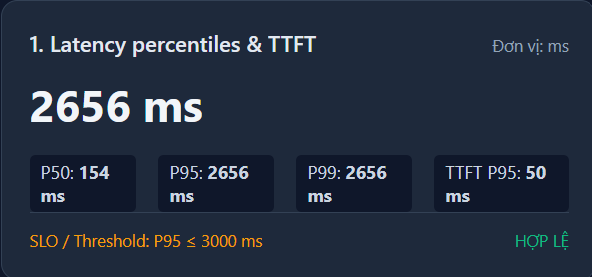

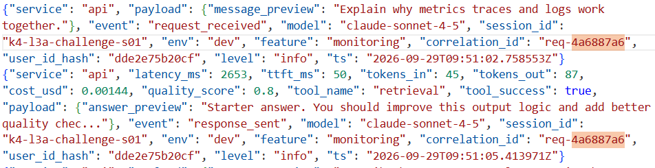

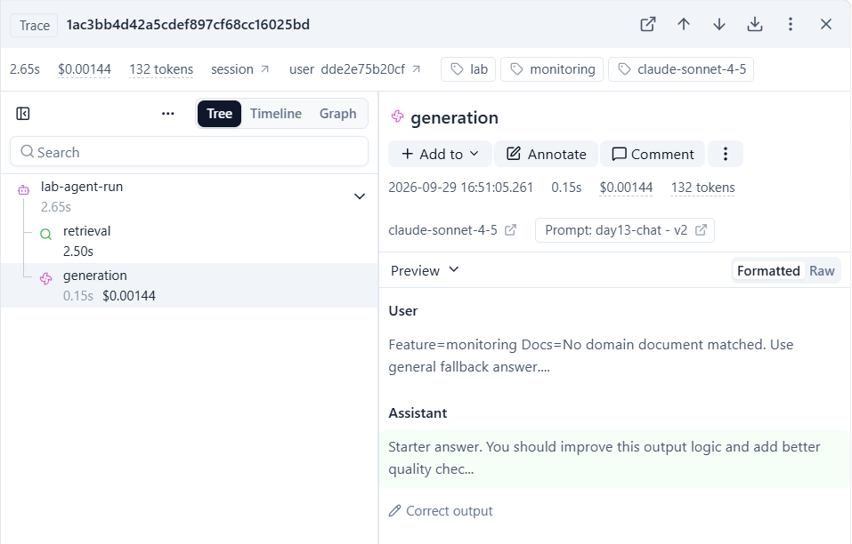

## 8. Giải thích và tự đánh giá

- **Một quyết định kỹ thuật quan trọng và lý do:** Thiết kế `scrub_event` đệ quy xử lý mọi string trong dictionary/list và đặt processor này ngay trước `JsonlFileProcessor` và `JSONRenderer` trong pipeline structlog. Quyết định này giúp loại bỏ nguy cơ rò rỉ dữ liệu PII ở tầng thấp nhất (centralized logging pipeline), bảo đảm dù log được gọi ở bất cứ đâu (payload, error message hay custom field) thì dữ liệu nhạy cảm đều được làm sạch trước khi ghi xuống đĩa hoặc stdout.
- **Một lỗi/blocker đã gặp:** Ban đầu khi chạy validator, điểm số logging chỉ đạt 30/100 do thiếu correlation_id và các trường ngữ cảnh `user_id_hash`, `session_id`, `feature`, `model` trong event dict của log.
- **Cách tìm nguyên nhân và xử lý:** Đọc mã nguồn `scripts/validate_logs.py` để nắm rõ các trường yêu cầu trong `REQUIRED_FIELDS` và `ENRICHMENT_FIELDS`. Sau đó sử dụng `structlog.contextvars.bind_contextvars` trong `CorrelationIdMiddleware` và controller `/chat` để inject tự động các trường này vào mọi log record trong cùng request context.
- **Cách hiểu luồng Metrics → Logs → Traces:**
  - **Metrics** là tầng quan sát đầu tiên giúp phát hiện triệu chứng (symptom) và khoảng thời gian xảy ra bất thường (ví dụ: Latency P95 tăng vọt lên 2656ms).
  - **Logs** là tầng trung gian giúp xác định request cụ thể bị ảnh hưởng trong khoảng thời gian đó, cung cấp ngữ cảnh chi tiết và trích xuất `correlation_id` (ví dụ: request `req-4a6887a6` có latency 2653ms).
  - **Traces** là tầng phân tích sâu nhất: dùng `correlation_id` để tra cứu trace trên Langfuse, phân rã cây waterfall thành từng span (`retrieval`, `generation`) nhằm xác định đích danh bước nào gây chậm/lỗi (nguyên nhân gốc rễ là span `retrieval` bị trễ 2502ms).
- **Vai trò của prompt version, token/cost, SLO hoặc rollback trong vận hành LLM:**
  - *Prompt versioning & Rollback:* Giúp kiểm soát sự thay đổi của prompt như mã nguồn phần mềm. Khi một prompt candidate gây giảm chất lượng hoặc tăng đột biến độ dài/chi phí, có thể lập tức rollback nhãn `production` về version trước mà không cần redeploy code.
  - *Token & Cost:* Cho phép theo dõi sát sao ngân sách tài nguyên; phát hiện sớm các hiện tượng prompt injection, loop suy luận hoặc model hallucination sinh quá nhiều token làm vượt trần ngân sách ($2.50).
  - *SLO & Error budget:* Đóng vai trò là "la bàn" thỏa thuận chất lượng dịch vụ giữa kỹ thuật và người dùng, giúp đội ngũ biết khi nào hệ thống ổn định để tiếp tục phát triển tính năng mới và khi nào cần đóng băng để xử lý nợ kỹ thuật.
- **Điều quan trọng nhất đã học:** Khả năng xây dựng khả năng quan sát (observability) toàn diện cho ứng dụng LLM/RAG thông qua chuỗi liên kết chặt chẽ giữa Metrics, Structured Logs và Distributed Tracing, kết hợp với các nguyên tắc bảo mật dữ liệu nhạy cảm (PII redaction).
- **Hạn chế hoặc phần chưa hoàn thành, nếu có:** Hệ thống sử dụng fake LLM và in-memory vector store cho môi trường lab; trong môi trường sản xuất thực tế cần kết nối với vector DB phân tán (Milvus/Qdrant/Pinecone) và mô hình ngôn ngữ lớn thực tế với rate limiting và streaming TTFT thực tế.

## 9. Checklist trước khi nộp

- [x] Kết quả và evidence thuộc commit SHA cuối.
- [x] Tất cả ảnh/output mở được bằng đường dẫn tương đối.
- [x] Incident evidence nối đúng metric → log → trace.
- [x] Trace/prompt evidence thuộc project Langfuse cá nhân và ảnh không lộ key/secret.
- [x] Repository chạy lại được theo README.
- [x] Không có secret, API key, PII thô hoặc evidence của người khác/lớp khác.
- [x] URL repo và commit SHA cuối đã được nộp trên LMS/Codelabs.
